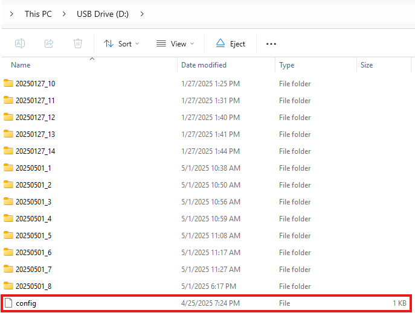

## Digital Data Logger with Information Loss Prevention in Case of Power Failure

- Author: Tomáš Dolák 
- Login: [xdolak09](https://www.vut.cz/lide/tomas-dolak-247220)
- Email: <xdolak09@stud.fit.vutbr.cz>
- Supervisor: Ing. Václav Šímek
- Consultant: Ing. Martin Moštěk PhD.

The Goal of This Project Is To Developt Digital Data Logger That Captures Serial Data From a UART Peripheral, Timestamps It, and Stores The Logged Data on an SD card. 
A Key Requirement of The Implementation is To Ensure Data Integrity by Preventing Loss In The Event of a Power Failure.

This Digital Data Logger Was Developed Based on The Requirements Provided by The Wireless Charging Team at NXP Semiconductors. 
The Device Will Be Used For Testing Customer Wireless Charging Devices in Qi Certification Laboratories Located in Various Parts of The World. 
The Digital Logger Will Assist In Verifying and Analyzing The Behavior of The Tested Wireless Charging Transmitter.

### Table of Contents
- [Requirements](#requirements)
    - [Hardware Components](#hardware-components)
    - [Software Requirements](#software-requirements)
- [Repository Organization](#repository-organization)
- [How to Use the Digital Data Logger](#how-to-use-the-digital-data-logger)
    - [Data Recording](#data-recording)
    - [Reading Data from the Datalogger](#reading-data-from-the-datalogger)
    - [Structure of Logged Data](#structure-of-logged-data)
- [Developer Notes](#developer-notes)
    - [Modules](#modules)
- [Testing](#testing)
- [Known Issues](#known-issues)

### Requirements 
To build and run `datalogger`, you will need the following:

#### Hardware Components
1. NXP FRDM-MCXN947 Development Board
2. Expansion Shield Proposed In This Bachelor Thesis

#### Software Requirements
1. MCUXpresso IDE v11.10.0 With GCC-based ARM Embedded Toolchain (Arm-none-eabi-gcc Compiler)

### Repository Organization
```
/nxp-mcxn947-datalogger
├── application/                # Main Directory With Digital Recorder Firmware
│   ├── source/                 # Contains The Firmware Source Files
│   ├── doc/                    # HTML and LaTeX Firmware Documentation Generated by Doxygen
│   └── include/                # Contains The Firmware Header Files
│
├── hardware/
│   ├── components/             # List of Used Hardware Components on Expansion Shield
│   ├── design/                 # KiCAD Project Containing Schematic and PCB Design
│   └── pinout_datalogger.xlsx  # Table With Overview of Microcontroller Pin Connections.
├── power_consumption/          # Digital Data Logger Power Consumption Data, Measured By Power Profiler Kit II
├── tests/
│   ├── functional_tests/       # Functional Test Folder For Verifying Correct Data Collection
│   │   ├── test_files/         # Test Files Used By serial_tests.py Script
│   │   ├── README.md
│   │   └── serial_tests.py     # serial_tests.py Script
│   └── static_analysis/
│       ├── outputs/            # Contains Outputs of Static Code Analysis According To MISRA C:2012 Rules, Performed by PC-lint Tool
│       ├── parsers/            # Contains Parsers That Filter Rule-Breakings MISRA Rules From The Required and Mandatory Categories
│       ├── lint_config.lnt     # Configuration File of PC Lint Plus
│       └── sources.lst         # Defines a Set of Files To Be Analyzed by PC Lint Plus
├── thesis/
│   ├── main_page.tex
│   ├── /pics
│   └── make/
│
├── config/                     # Contains a Sample Configuration File That Can Be Used To Configure The Behaviour of The Digital Recorder
├── README.md
```

### How to Use the Digital Data Logger

#### Signal Diodes

The Digital Data Logger Is Equipped With Five Status LEDs (Labeled 1–5) Located On The Front Side Of The Enclosure. These LEDs Visually Indicate The Current Operational State Of The Logger.

The Image Below Shows The Placement And Labeling Of Each LED On The Front Panel Of The Enclosure:

<p align="center">
  <br>
  <em>Data Logger Status LEDs </em><br>
</p>

The Table Below Describes The Function Of Each LED:

| LED | Description        |
|-----|--------------------|
| 1   | Lights Up When The Available Free Space On The SD Card Falls Below The Limit Defined By The `free_space` Parameter In The Configuration File.|
| 2   | Indicates An Error Condition. This LED Turns On If The Configuration File Is Invalid Or If A Critical Error Occurs During Data Recording (E.g., File Creation Failure Or UART Framing Error).   |
| 3   | Signals That The Data Logger Is No Longer Actively Recording. This State Occurs, For Example, When The Monitored Device Stops Transmitting Data Or Is Disconnected.          |
| 4   | Blinks During Active Data Recording To Indicate That Data Is Being Received And Saved To The SD Card.       |
| 5   | Lights Up Approximately 16 Seconds After Powering The Logger To Indicate That The Backup Capacitor Is Sufficiently Charged. Once Lit, It Is Safe To Disconnect The Device From Power Without Risking Data Loss.     |

#### Data Recording
1. **(Optional But Recommended)** Prepare The Configuration File `config`, Which Should Be Placed in The Root Directory of The SD Card. 
This File Allows You To Customize The Data Logger's Behavior Instead of Using The Default Configuration.

<p align="center">
  <br>
  <em>Location of The config File on The SD Card</em><br>
</p>


Example content of `config`:
```
baudrate=115200
file_size=2048
stop_bits=1
data_bits=8
parity=none
free_space=50
```
- **Note:** The Order of Parameters Is Not Fixed.

If Some of The Parameters in The Configuration File Are Missing or The Configuration File is Missing Completely, 
The Default Values Defined In The `defs.h` File Are Used

| Parameter      | Default Value                 | Data Type                      |
|----------------|-------------------------------|--------------------------------|
| `baudrate`     | `230400`                      | uint32_t                       |
| `file_size`    | `8192`                        | uint32_t (in KB)               |
| `stop_bits`    | `kLPUART_OneStopBit`          | enum (lpuart_stop_bit_count_t) |
| `data_bits`    | `kLPUART_EightDataBits`       | enum (lpuart_data_bits_t)      |
| `parity`       | `kLPUART_ParityDisabled`      | enum (lpuart_parity_mode_t)    |
| `free_space`   | `50`                          | uint32_t (in MB)               |


2. Insert The SD Card (Type SDHC) Into The Data Logger 

3. Power On The Data Logger Via USB or Another Power Source. The Data Logger Will Automatically:

-  Load The Configuration From `config` (If Present)
-  After Startup, The Data Logger Enters The Recording Mode By Default. At The Beginning of Record Task, It Initializes The SD Card and If a New or Unformatted Card Is Detected, 
   The Firmware Will Automatically Formatted and The FAT File System With 32-bit LBA is Initialized.

4. Wait Until The 5 LED Indicator Turns On.  
   This LED Indicates That The Digital Data Logger Can Be Safely Disconnected Without The Risk of Data Loss Or File System Corruption.

5. Connect The Digital Data Logger to The Monitored Device That Transmits Serial Data via UART.  
   Once The Data Transmission Starts, The Data Logger Will Indicate Active Reception by Blinking a Dedicated LED 4,  
   Which Is Shown in The Following Image.

6. At This Point, The Digital Data Logger Is Actively Recording Incoming UART Data.  
   During Recording, The Same LED Continuously Blinks To Indicate That Data Logging Is in Progress.

7. If an Error Occurs During UART Data Reception (e.g. Framing Error),  
   The Digital Data Logger Will Illuminate a Separate Error LED 2  
   to Indicate That Logging Has Been Interrupted Due to a Fault.

   If the Error Prevents Further Data Reception, an Additional LED 3 Will Also Light Up  
   to Signal That The Device Can No Longer Continue Logging Until It Is Restarted or the Error is Resolved.

8. To Safely Stop Data Logging, Disconnect The Digital Data Logger From The Monitored Device.  
   At This Point, All Buffered Data Will Be Properly Finalized and Stored on The SD Card.  
   The Status LED D3 Will Then Light Up To Indicate That Data Reception Has Been Halted  
   And The Device Is in Standby Mode.

9. To Resume Data Logging After It Has Been Halted, Simply Reconnect The Digital Data Logger  
   to The Monitored UART Device. The Logger Will Automatically Return to Recording Mode  
   (Described in Step 6) and Continue Capturing Incoming Data.

10. In The Event of a Power Disconnection During Logging,  
    The Digital Data Logger Detects The Power Loss and Automatically Saves All Buffered Data.  
    The Recording Is Then Gracefully Finalized To Prevent Data Loss or File System Corruption.

#### Reading Data from the Datalogger
To Read The Recorded Data From The Digital Data Logger, Simply Connect The Device To a Computer Using The USB1_HS Connector. 
The Data Logger Will Automatically Switch Into Data Acess Mode (MSC mode), and The SD Card Will Be Exposed as a Standard Mass Storage Device, 
Allowing The User To Copy The Recorded Data Files.

<p align="center">
  <br>
  <em>Organization of Session Directories With Logs on SD Cards</em><br>
</p>

#### Structure of Logged Data
After Each Startup, The Data Logger Creates a New Session Directory In Which All The Logs From The Current Runtime Are Stored. 
These Session Folders Are Organized By The Date and an Incrementing Counter In The Format:

```
YYYYMMDD_X/
```

Where:
- `YYYYMMDD` is The Date of The Session Creation
- `X` is an Integer Session Index Used To Differentiate Multiple Sessions Created on The Same Day

After Data Has Been Recorded, Each Session Folder Contains Text-Based Log Files Storing The Data Collected During The Corresponding Session. 
The Maximum Size of Each Log File is Determined by The `file_size` Parameter Defined in The Configuration File (See Chapter on Configuration). 
Log files are named using the following format:

```
YYYYMMDD_HHMMSS_X.txt
```

- `YYYYMMDD_HHMMSS` is The Timestamp When The Log File Was Created
- `X` is an Index Used To Differentiate Multiple Files Created at The Same Second


### Developer Notes
All Application-Level Source and Header Files are Located In The `source/` and `include/` Directories.

The Firmware is Structured Into Several Functional Modules, Such as Recording Logic, Mass Storage Access, Power Loss Detection, And System Status Signaling.
Many of These Modules Can Be Individually Enabled or Disabled as Needed. This Behavior is Achieved Through Conditional Compilation in ISO C and Logic Blocks are Active Only 
If Enabled via Preprocessor Macros. These Settings are Centrally Managed in The Application Configuration Header File `defs.h`.

The defs.h Configuration File Also Includes The Option To Control The Verbosity of Firmware Output Messages. The Firmware Supports Three Message Output Levels:

- **Error Messages** (Prefixed With `ERR:`) Reports Critical Conditions. This Level Is Always Active and Can't Be Disabled.

```
PRINTF("ERR: Failed to Create File %s. Error=%d\r\n", u8FileName, (uint32_t)status);
```

- **Informational Messages** (Prefixed With `INFO:`) Provide Context Such as Initialization Progress, Configuration File loading, Creation of Log, etc.

```
PRINTF("INFO: Created Log %s.\r\n", u8FileName);
```

- **Debug messages** (Prefixed With `DEBUG:`) Offers The Most Detailed Output and Include Additional Technical Details Useful During Development.

```
PRINTF("DEBUG: File System Not Found. Creating FAT File System...\r\n");
```

All of These Outputs Are Provided Through The UART Serial Interface. The firmware Uses The `LP_FLEXCOMM4` UART Peripheral Instance, 
Configured With The Following Parameters:

| Parameter      | Value    | 
|----------------|----------|
| Baudrate       | 115200   |
| Data Bits      | 8        |
| Stop Bit       | 1        |
| Parity         | None     |

The Firmware Runs on The FreeRTOS Real-Time Operating System. To Ensure Maximum Reliability and Predictability, Only Static Memory 
Allocation is Used Throughout The Firmware. All Tasks and Synchronization Primitives are Created With Predefined Memory Sizes, 
and Dynamic Memory Allocation is Fully Disabled in The FreeRTOS Configuration. Additionally, Specific Memory Allocation Functions 
For System Tasks Such as The Idle Task and Timer Task Have Been Implemented to Support Fully Static Operation.

The overall hardware and software initialization procedures are handled by `APP_InitBoard()` Function Declared in Header File _app_initialization.h_ and Defined 
in Source File The _app_initialization.c_.

The Application Consists of two FreeRTOS Tasks - _record_task_ That is Responsible For Recording UART Data and _msc_task_ Responsible For Exposing The Recorded Data 
via USB. These Tasks Are Implemented In `app_tasks.c` and `pp_tasks.h`, and Are Created and Started From Within The `main.c` File.

### Modules
The Application Files (`main.c`, `app_tasks.c`, and `app_initialization.c`) Utilize The Following Separate Modules, 
Each Module Has Its Own Source and Header File:

- `error`  Handles Errors and Defines Error Codes.
- `led`  Manages LED Indicators For System Status.
- `mass_storage` – Provides Access To Log Files Over USB MSC.
- `parser` – Parses the Configuration File (`config`) From The SD card.
- `pwrloss_det` – Detects and Reacts on Power Loss.
- `record` – Implements Logic For Recording Incoming Serial Data From UART.
- `task_switching` – Includes The Method For Detection of Attach or Detached Application USB.
- `time` – Provides Date/Time Handling For File Naming and Timestamping (External and Internal RTCs).
- `uart` – Includes Intialization (+ Configuration), Enablement and Disablement of UART Periphery.
- `temperature` – Extension For Temperature Measurement of The P3T1755 On-Board Temperature Sensor on FRDM-MCXN947.

### Testing

#### Functional Testing
The Digital Data Logger Was Tested Using a Python Script Located in The tests/ Directory Under Name serial_test.py.

The Script serial_test.py Simulates The Monitored Device By Reading The Test Text Files and Sending Their Contents as Serial Data Through The COM Port To The Digital Data Logger. 
There is a Time Delay Between Each File Being Sent, Which Deliberately Causes The `CONSOLELOG_Flush()` Function To Be Called, So That Each Test Input is Recorded in a Separate File That Can Be Compared Against The Original Test File.

Scripted Testing Was Performed At Various Baud Rates, With Testing Primarily Focused on Baud Rates Corresponding To Actual Deployment Scenarios. 
After The Test Was Completed, The Recorded Outputs Were Compared To The Original Test Files. The Results of The Comparison Confirmed That In All Cases Tested, 
The Transfer Was Correct And There Was No Data Loss or Corruption.

Functional Testing Also Covered The Behavior Of The Digital Recorder In Non-Standard Scenarios That May Occur During Real-World Deployment. 
The Results Are Summarized In Table Below.

| Test Description                                                      | Expected Result                                                                                   | Passed |
|-----------------------------------------------------------------------|---------------------------------------------------------------------------------------------------|--------|
| Missing Configuration File                                            | Error Indication Using LED D2, Recording Interrupted                                              | Yes    |
| Missing `baudrate` Value In Configuration                             | Start Recording With Default `baudrate` Value                                                     | Yes    |
| Recording On A New Unformatted SD Card                                | SD Card Is Formatted, File System Initialized, And Device Then Records Incoming Data              | Yes    |
| Recording With File Size Of 512 B                                     | File Created And Properly Closed Upon Reaching Limit                                              | Yes    |
| Recording With File Size Of 1 MB                                      | File Created And Properly Closed Upon Reaching Limit                                              | Yes    |
| Low Free SD Card Capacity (i.e., Below Value of Parameter`free_space`)| Indication Via LED                                                                                | Yes    |
| Transfer Of Recorded Data From The Digital Recorder                   | Records Transferred To Host Device From The Digital Recorder                                      | Yes    |


#### Static Code Analysis
In Addition To Functional Testing, Static Analysis of The Source Code Was Performed Using Rules From The MISRA (Motor Industry Software Reliability Association) Specification, Specifically MISRA C:2012. The Focus Was Primarily On Rules Classified as Required And Mandatory. All Detected Violations In These Categories Were Either Corrected Or Justified Through Comments In The Source Code, Including A Reference To The Relevant Rule and a Rationale For The Exception.

### Known Issues
No Issues Were Observed During Development, Testing, or Practical Usage of The Digital Data Logger.